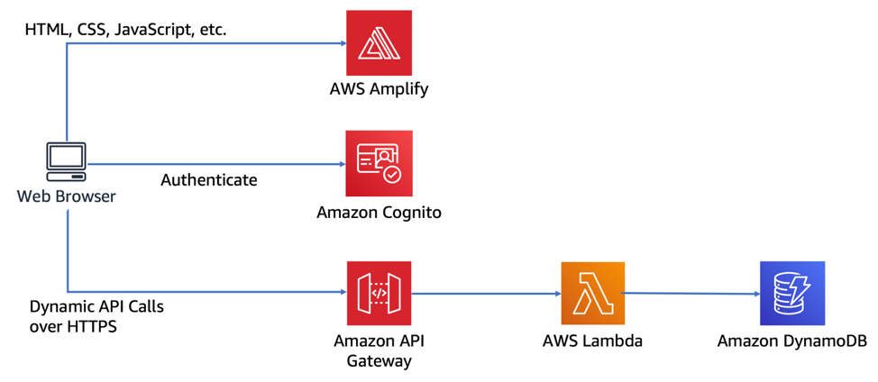

# Wild rydes

Implementation of https://aws.amazon.com/it/getting-started/hands-on/build-serverless-web-app-lambda-apigateway-s3-dynamodb-cognito

## Architecture



## Useful commands

- `npm run build` compile typescript to js
- `npm run watch` watch for changes and compile
- `npm run test` perform the jest unit tests
- `cdk deploy` deploy this stack to your default AWS account/region
- `cdk diff` compare deployed stack with current state
- `cdk synth` emits the synthesized CloudFormation template

## Create AWS secret for github access token

```
aws secretsmanager create-secret --name github-access-token --secret-string <github-token>
```
